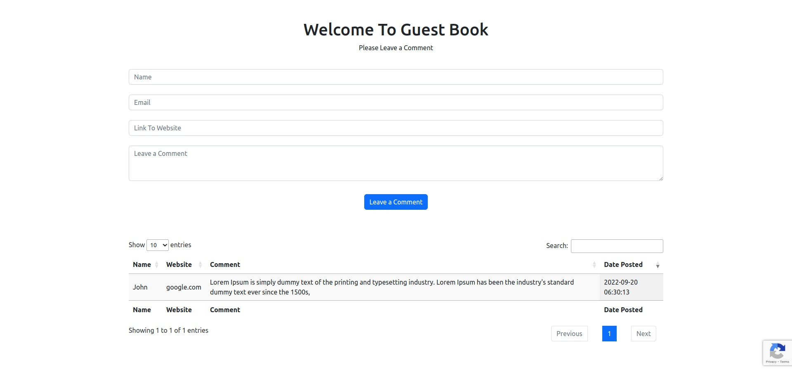

# PHP/Laravel/AngularJs/MySql created Guest Book app.

### Application for leaving guest book comments, 
### records to database name, email, website, comment, ipaddress browser of user. Additional added google v3 captcha.
### online host: www.larajsangular.win
## This app is only for demonstration purposes only!


---



---


# How To Set up:


## Requirements:

### Mysql or any other database for information storing.
### PHP installed on your machine

### 1. Clone or download to your chosen directory

### 2. Open with your chosen editor.

### 3. First you need  to rename .env.example file to .env.

### 4. Next fill the .env file in core folder with your:
#### MySql(or any other db, then change driver in .env from mysql to sqlite etc..)


### 5. Set in .env file ip address/databases name, which will be used/username/password if exists.

## Execute commands specified in terminal successfully:

### 6. Migrate database migrations to fill your database with all the necessary tables and columns:

```

php artisan migrate

```


### 7. Run the App command:

````

php artisan serve

````


## Enjoy!

---
